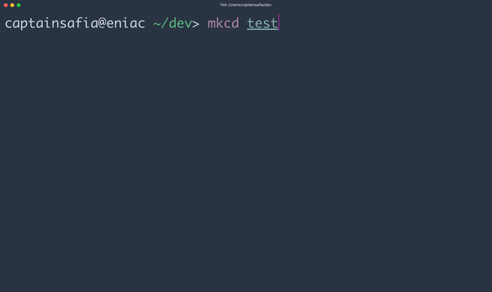

# legit

legit is a command line application that allows you to automagically generate a
LICENSE file for the current working directory that you are in.

### Installation

```
npm install --global @captainsafia/legit
```

### Usage

```
  Usage: legit [options]

  Options:

    -h, --help               output usage information
    -V, --version            output the version number
    -a, --list-all           List installed licenses
    -l, --license <license>  The license (SPDX ID) to include
    -u, --user <user>        The individual who owns the license
    -y, --year <year>        The year the license is effective
    -d, --oneline <oneline>  One line to give the program name and a brief idea of what it does

```



### Available Licenses

legit uses SPDX license IDs and definitions as a backend, therefore all [SPDX licenses](https://spdx.org/licenses/) are supported.

Additionally, it allows to replace placeholders in the license text with command-line options; placeholders are defined by [license-placeholders.yml](license-placeholders.yml).

### Known issues

- placeholder list is hardcoded (`user`,`year`,`oneline`), should be parametric
- add more items in [license-placeholders.yml](license-placeholders.yml)
- make `license-placeholders.yml` url configurable
- allow to resolve `license-placeholders.yml` with a file-system path
- placeholders including `'` character don't work
